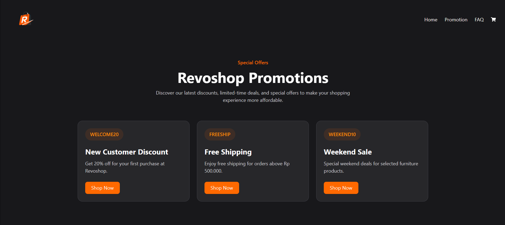
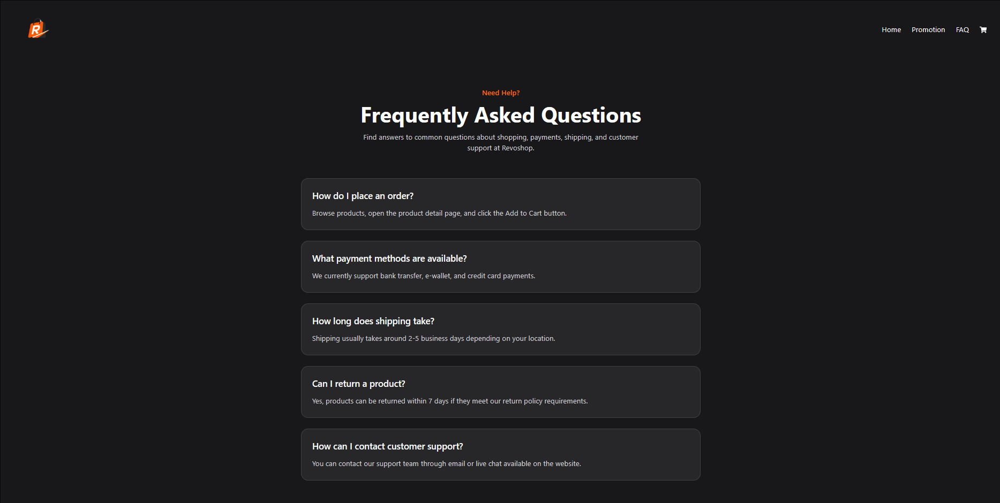
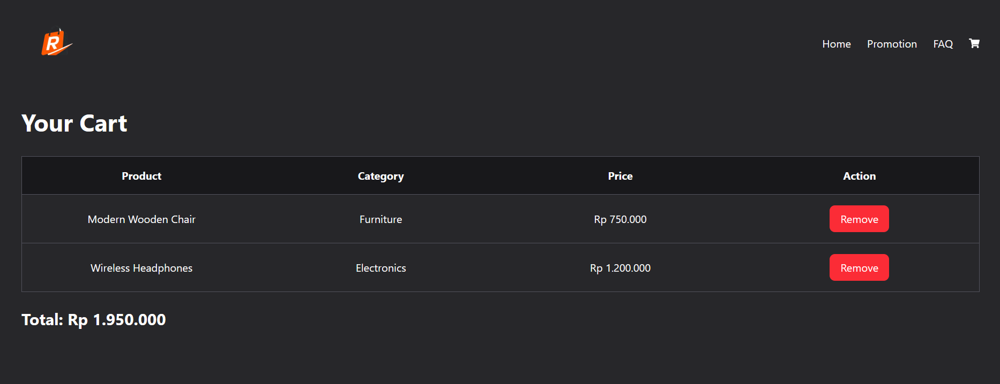
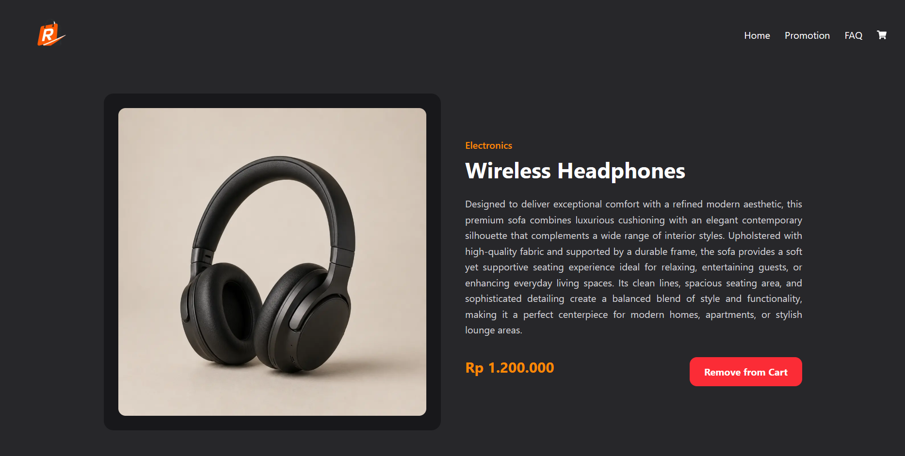

# REVOSHOP SHOPPING PLATFORM

--- 

🔗 [View Live REVOSHOP SHOPPING PLATFORM](https://revoshop-123.netlify.app)

--- 

## OVERVIEW

**REVOSHOP is a modern shopping platform designed to provide a simple, convenient, and enjoyable online shopping experience**. The website allows users to browse a variety of products, explore detailed product information, and manage items through an interactive shopping cart system. With a clean and user-friendly interface, REVOSHOP makes online shopping more accessible and engaging for users across different devices.

The website is thoughtfully **structured into multiple pages**, including a **Home Page** displaying product listings, **Promotion and FAQ** pages for additional information, a **Product Detail Page** presenting complete product descriptions and pricing, and a **Cart Page** where users can manage selected products. Each section is designed to create a seamless shopping experience while demonstrating the core functionality of a modern e-commerce platform.

Built using modern web technologies, REVOSHOP focuses on responsive design, dynamic routing, reusable components, and smooth client-side navigation to ensure an efficient and interactive user experience. This project represents both a practical implementation of e-commerce fundamentals and a demonstration of modern frontend web development using Next.js and Tailwind CSS.

---

## KEY FEATURES

Built using modern web technologies, **REVOSHOP focuses on dynamic routing, reusable components, and smooth client-side navigation to ensure an efficient and interactive user experience**. This project represents both a practical implementation of e-commerce fundamentals and a demonstration of modern frontend web development using Next.js, Tailwind CSS, and Typescript.

There are several types of features implemented in this platform, such as:

1. **Product Listing System**. Displays a collection of products in a clean and organized layout, allowing users to easily browse products with images, categories, and pricing information.
2. **Dynamic Product Detail Page**. Each product has its own dedicated detail page that provides complete product information, including descriptions, pricing, and product images through dynamic routing implementation.
3. **Shopping Cart Functionality**. Users can add products to the cart, remove products from the cart, and manage selected items through an interactive cart system with persistent local storage support.
4. **Client-Side Navigation**. Implements smooth navigation between pages using Next.js routing system to create a faster and more seamless user experience without unnecessary page reloads.
5. **Static Information Pages**. Includes additional pages such as Promotion and FAQ to provide users with promotional offers, shopping information, and customer support guidance.

---

# TOOLS AND TECHNOLOGIES

The development of this shopping platform involved the **use of several tools and technologies to ensure a clean interface and smooth shopping experience**. Each component was carefully designed and implemented to create a modern and user-friendly e-commerce platform while demonstrating frontend development concepts and interactive web application features.

1. **Tools**
    - **Visual Studio Code (VS Code)**: Used as the **primary code editor for writing, organizing, and maintaining the project files**, including Next.js components, styling, and application logic.
    - **Opera GX**: Utilized as the **web browser for previewing, testing, and evaluating the functionality** of the website during development.
    - **GitHub**: Used to **store, manage, and share the project repository** while supporting version control and collaborative development workflows.
    - **Netlify**: **Used as the deployment platform to host and publish** the REVOSHOP shopping platform online for public access.

2. **Technologies**
    - **Next.js**: Utilized as the **main React framework to build the shopping platform** with file-based routing, dynamic routing, reusable components, and optimized client-side navigation.
    - **React.js**: Implemented to **create interactive and reusable UI components** while managing application state and rendering dynamic content efficiently.
    - **Tailwind CSS**: Applied as the **primary styling framework** to rapidly build a modern and consistent user interface using utility-first CSS classes.
    - **TypeScript**: Used to **develop type-safe and scalable application logic**, including shopping cart functionality, local storage management, dynamic product rendering, and user interaction handling throughout the platform. TypeScript helps improve code maintainability, readability, and error prevention during development.
    - **LocalStorage API**: **Implemented to preserve cart data locally within the browser**, allowing users to maintain their shopping cart contents even after refreshing the page.

---

## HOW TO DEPLOY AND ACCESS THE PLATFORM

### Deployment

This website is deployed using Netlify by following these steps:

1. Push the latest project changes to the GitHub repository.
2. Sign in to the Netlify platform.
3. Click the "Add new site" button and select "Import an existing project".
4.Connect Netlify with the GitHub account and authorize repository access.
5. Select the REVOSHOP project repository from the GitHub repository list.
6. Configure the build settings:
    - Build Command: npm run build
    - Publish Directory: .next
7. Click the "Deploy Site" button to start the deployment process.
8. Wait until the deployment is completed successfully.
9. Netlify will automatically generate a live deployment URL that can be accessed publicly.

After a few minutes, Netlify will automatically build, publish the website, and the live URL will be generated and displayed

### Live Website

REVOSHOP Shopping Platform is now live and can be accessed through the link below:

`https://revoshop-123.netlify.app`

Once opened, users can navigate through the main sections of the website:

- **Home** – Displays product listings and provides an overview of the REVOSHOP shopping platform.
- **Product Detail** – Shows detailed information about selected products, including images, descriptions, categories, and pricing.
- **Promotion** – Presents promotional offers, discounts, and special deals available on the platform.
- **FAQ** – Provides answers to common questions related to shopping, payments, shipping, and customer support.
- **Cart** – Allows users to manage selected products by adding or removing items from the shopping cart.

---

## PLATFORM'S SCREENSHOT
### HomePage

### Promotion Page

### FAQ Page

### Add To Cart Page

### Product Detail Page

